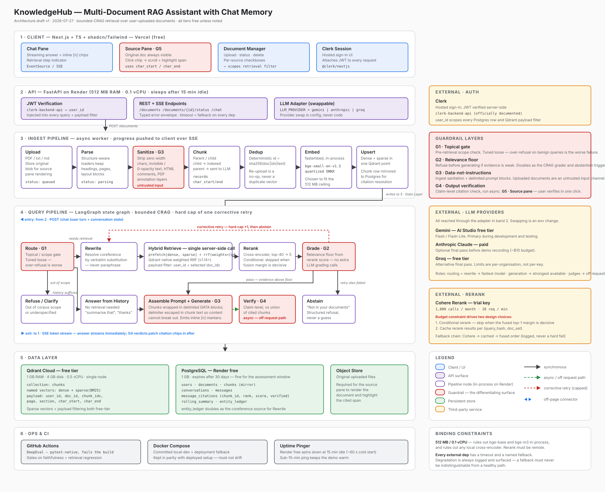

# KnowledgeHub

A multi-document RAG assistant with chat memory: upload PDFs, text or Markdown into a
workspace, ask questions across all of them, and get answers grounded in the retrieved
passages with citations that click through to the exact highlighted span they came from.

Built as a CV assessment. The brief asked for upload, hybrid retrieval, multi-turn memory,
citations, and a clean API — this README documents what was built against that brief and,
more importantly, *why* it was built this way rather than the more obvious way.

## Contents

- [Quick start](#quick-start)
- [Architecture](#architecture)
- [What each requirement actually does](#what-each-requirement-actually-does)
- [Design decisions](#design-decisions)
- [Invariants](#invariants)
- [What's deliberately unresolved](#whats-deliberately-unresolved)
- [Testing](#testing)
- [Repository layout](#repository-layout)
- [Known limitations](#known-limitations)

## Quick start

### Docker Compose (recommended — no accounts required)

```bash
cp backend/.env.example backend/.env
cp frontend/.env.example frontend/.env.local
# Fill in at least one LLM key in backend/.env — GROQ_API_KEY is the default
# provider and has the most generous free tier. The stack runs with no key at
# all up to the point of generation; everything upstream of that (upload,
# parsing, chunking, embedding, hybrid retrieval) works without one.

docker compose up --build
```

- Frontend: http://localhost:3000
- Backend: http://localhost:8000 (`/healthz`, `/docs`)
- Runs with `AUTH_MODE=dev` by default — every request is assigned the same fixed user, so
  there is nothing to sign in to and no Clerk account is required to see the system work.
- Migrations run automatically on container start (`alembic upgrade head`, idempotent — see
  `backend/docker-entrypoint.sh`). There is no separate migration step to remember.

### Manual development setup

Backend (Poetry-managed, isolated at `backend/.venv`):

```bash
cd backend
poetry config virtualenvs.in-project true   # once per machine
poetry install                               # dev group included
cp .env.example .env                         # fill in keys
docker compose up -d postgres qdrant         # just the datastores
poetry run alembic upgrade head
poetry run uvicorn app.main:app --reload --port 8000
```

Frontend (pnpm-managed, isolated at `frontend/node_modules`):

```bash
cd frontend
cp .env.example .env.local
pnpm install
pnpm dev
```

Diagnostics:

```bash
cd backend
poetry run pytest -q                                    # 292 tests; 10 integration tests skip unless postgres+qdrant are up
poetry run ruff check app tests scripts evals
poetry run mypy app
PYTHONPATH=. poetry run python scripts/verify_api.py     # acceptance test against a live stack
```

`verify_api.py` is the honest end-to-end check: it uploads real documents into the running
API, waits for ingest, asks a question, resolves a citation back to the literal characters
in the source document, asks a follow-up with a pronoun and confirms it resolves against
conversation memory, confirms the conversation persisted in Postgres, and exercises the
error taxonomy (404, validation 400, unsupported media type). Unit tests cover components
in isolation; this is what actually proves the product works.

## Architecture



Three stores, kept deliberately separate:

- **Qdrant** — chunk vectors, dense (`bge-small-en-v1.5`, fastembed) and sparse (`Qdrant/bm25`)
  named vectors in one collection, fused server-side with weighted RRF in a single call.
- **Postgres** — documents, a chunk mirror for citation resolution, conversations, messages,
  per-citation retrieval trace (`message_citations`), workspaces.
- **Conversation state** — rolling summary and entity ledger, updated after a turn completes,
  never during it, and never read by retrieval. User preferences live in a fourth table and
  are equally excluded from the query path — a stored tone preference must never silently
  distort what gets searched.

**Ingest** (in-process background task, not a separate worker — 750 free instance-hours on
Render is not enough for two services): upload → tiered parse → sanitize → chunk → dedup →
embed → upsert. Tier 1 is local (`pypdf`/`pdfplumber`); a page a cheap local heuristic flags
as complex escalates to a vision model through the same LLM adapter used for generation.
Qdrant is written before Postgres — an orphaned vector is recoverable by re-running ingest, an
orphaned citation row is not.

**Query** (a LangGraph state graph, one shared `QueryState`): `route → rewrite → retrieve →
rerank → grade → generate`, with `verify` off the request path and `history`/`refuse`/`abstain`
as terminal nodes. Raw-query retrieval fires in parallel with `rewrite`, and the second Qdrant
call is skipped outright when the rewrite changed nothing — most turns therefore cost exactly
one retrieval round trip, not two.

The frontend is a workspace shell (Next.js App Router): a named group of documents that many
conversations share — upload once, open as many chats against that set as you like. `POST
/chat` streams Server-Sent Events over `fetch` + `ReadableStream`, not the browser's native
`EventSource` — that API is GET-only and cannot carry the auth header a POST-based chat
stream needs, so contract mentions of `EventSource` describe intent, not the literal API used.

## What each requirement actually does

| Requirement | Where it lives |
|---|---|
| Upload/manage multiple documents | `POST/GET/DELETE /documents`, live ingest progress over SSE, per-workspace document lists in the sidebar |
| Chunk + embed + store in a vector DB | `app/ingest/chunk.py` (parent-child), `app/ingest/embed.py` (fastembed), `app/retrieval/qdrant_store.py` |
| Multi-turn chat with context memory | `app/memory/conversation.py` (rolling summary + entity ledger), coreference resolution in the `rewrite` node |
| Grounded answers with citations | Delimited DATA blocks in `app/graph/prompts.py`, `[n]` markers resolved to `char_start`/`char_end` in `normalized_text` |
| Conversations in a DB | Postgres — `conversations`, `messages`, `message_citations` |
| Clean REST API with error handling | One error envelope (`app/errors.py`) — every failure carries `code`, `message`, `request_id`; 404 rather than 403 for cross-user access, so a taxonomy lookup can't double as an enumeration oracle |
| Streaming responses (bonus) | `POST /chat` SSE — token deltas, pipeline stage events, degradation events, all on one connection |
| Auth (bonus) | Clerk, skipped cleanly in `AUTH_MODE=dev` so the assignment can be evaluated with zero account setup |
| Hybrid search / re-ranking (bonus) | Server-side weighted RRF (dense + sparse) + conditional Cohere rerank |
| CI (bonus) | `.github/workflows/ci.yml` — lint, typecheck and the full test suite on every push, with Postgres and Qdrant as service containers so the integration tests actually run rather than skip |

## Design decisions

**Why hybrid retrieval, server-side.** Dense embeddings miss exact identifiers and error
codes; BM25 misses paraphrase. Qdrant's own weighted-RRF query (`prefetch: [dense, sparse]` +
`rrf`) fuses both in one round trip with `k` pinned in config — never inherited from the
server default, because `RRF_MAX` is computed analytically from `k` and the weights, and an
unpinned `k` would make every relevance threshold derived from it silently mean nothing on
the next Qdrant version bump.

**Why conditional rerank, not always-on.** Cohere's trial key is 1,000 calls/month at 10 rpm
— reranking unconditionally would cap the whole deployment at roughly a thousand lifetime
queries. Rerank is skipped when fusion is already *decisive*: the top result beats the
runner-up by a measured margin **and** is ranked top-3 by both the dense and sparse branch
independently. Cross-branch agreement is the signal, not margin alone — a huge margin on a
result invisible to one branch is one-sided evidence, exactly when a cross-encoder earns its
call. The margin threshold was tuned from a live probe (`scripts/probe_decisive_margin.py`)
rather than guessed: the naive placeholder (`1.5`) turned out to be *unreachable* given how
RRF scores are actually shaped, so it fired zero times across 53 real questions until
corrected to `1.02`.

**Why bounded CRAG, not an open agent.** The query graph retries retrieval at most once when
retrieved relevance is low, then abstains rather than guessing. An agent that could loop
indefinitely or choose its own tools trades a bounded latency budget for unbounded cost and
unpredictable failure modes, for a task (search these documents, answer the question) that
does not need that generality. LangGraph is used for its checkpointing and per-node event
streaming — the nodes are called directly rather than through `graph.ainvoke` so the SSE
contract's exact frame ordering is guaranteed by code, not by trusting the graph runtime's
internals — not for autonomy.

**The citation chain, end to end.** `build_normalized_text(Block[]) -> (text, spans)` is the
*only* function permitted to concatenate parsed content into a document's text — sanitisation
and derived-block insertion happen inside it, before offsets are assigned, and the resulting
string is immutable afterward. Every chunk's `char_start`/`char_end` indexes into that exact
string, all the way through retrieval, generation, and the citation the frontend renders — a
click on `[2]` scrolls the source pane to the literal characters the model read, not an
approximation. This is the one piece of schema that could not be retrofitted, and it was
built first for that reason.

**Retrieved document text is an untrusted input channel.** Users upload arbitrary PDFs, and
the model reads their content — this is a prompt-injection surface almost every "chat with
your documents" demo overlooks. Chunk content is wrapped in delimited `[[[DOCUMENT n]]]`
blocks with explicit data-not-instruction framing, and the delimiter sequence is escaped
inside chunk text (`[[[` → `[ [ [`) so a document cannot forge its own block boundary and
smuggle an instruction out of its wrapper.

**Degradation is never silent.** Every fallback — Cohere unavailable, rerank rate-limited, a
rewrite that timed out, the primary LLM's daily quota exhausted — appends a structured
`Degradation` record and emits an SSE `degradation` event, so a degraded answer is never
visually indistinguishable from a healthy one. This showed up as a real, load-bearing decision
rather than a nice-to-have: Groq's free tier metered the strongest generation model at 100k
tokens/day, invisible in the per-minute rate-limit headers and only surfaced in the error
body. The fix — a configured fallback model that a degraded turn switches to, with the switch
itself surfaced as a `degradation` event — is now how the app survives a quota exhausted
mid-demo instead of returning a bare 503.

**A relevance floor is a backstop, not a judge — and this was measured, not assumed.**
G2 gates on `0.6·max + 0.4·mean` over the retrieval scores. The obvious next move when
abstention underperforms is "the signal is wrong, use a better score." That was tested
directly (`scripts/probe_relevance_signal.py`, all 53 eval questions, four candidate signals):

| Signal | Separation (median gap / pooled sd) | Best achievable accuracy |
|---|---|---|
| fused RRF, all 40 candidates | +0.85 | 79% |
| fused RRF, top 5 | +0.89 | 74% |
| dense cosine, all 40 | +0.60 | 81% |
| dense cosine, top 5 | +0.72 | 81% |

In all four the should-decline population sits *inside* the answerable range, so no threshold
separates them — at 0.65 the gate never fires, at 0.80 it trades seven answerable questions for
seven declines, at 0.85 it rejects 33 of 39 answerable ones. The reason is structural rather
than a tuning miss: the unanswerable questions are *topically adjacent* — they ask for a figure
the corpus plausibly could hold but does not — so retrieval correctly returns on-topic chunks
and correctly scores them highly. Telling "right topic, missing fact" apart requires reading
the passage, which is exactly what the grounding prompt in `generate` does and what no scalar
retrieval score can encode. `FLOOR_FUSED` is therefore set *below* the entire observed
answerable range: it catches degenerate retrieval and never arbitrates a close call it
provably cannot judge. Over-refusal is the worse failure — a user cannot tell a refusal from a
broken product.

This measurement also overturned an earlier conclusion recorded in this repo. A smaller,
biased sample (n=25, drawn only from questions that happened to skip rerank in one run) had
suggested RRF was structurally incapable and dense cosine was the fix. Measured uniformly
across all 53 questions, RRF separates *better* than dense cosine and the accuracy gap is one
question. The change that sample would have justified was not worth making.

**Unknown is not zero.** A citation's `verified` field is `boolean | null`, never defaulted to
`false`. Claim-level verification runs asynchronously, off the request path, after the answer
has already streamed — if it fails or never completes, the citation stays in its neutral,
not-yet-checked state rather than being reported as *unsupported*, which would be a specific,
false claim about a passage nobody actually checked.

**Rejected, with reasons on record:** HyDE (a live probe showed no measurable retrieval
improvement over query rewriting for this corpus shape), GraphRAG (this is a bounded document
set, not the kind of multi-hop entity network that graph retrieval earns its complexity for),
embedding fine-tuning (no labelled corpus to fine-tune against, and `bge-small` already fits
the 512 MB ceiling), client-side dense/sparse fusion (Qdrant does this server-side in one
call — reimplementing it in application code would be solving an already-solved problem,
worse), and Railway (Render's free tier facts were verified directly; Railway's were not, and
guessing infrastructure limits is exactly the kind of unverifiable claim this project avoids).

**LlamaParse (Tier 3 parsing) is out of scope.** Tier 1 (local `pypdf`/`pdfplumber`) plus Tier
2 (VLM escalation for pages a cheap heuristic flags as complex) already covers the table and
figure story; a paid third-party parsing tier adds cost and an unconfirmed free tier for a
problem the first two tiers already solve.

## Invariants

The full list lives in the retrieval pipeline contract; the ones most easily broken by
reasonable-looking code:

- **Degradation is never silent** (see above).
- **Unknown is not zero** — a failed judge yields `null`, never `false`.
- **`user_id` scopes everything** — every Postgres query and every Qdrant search carries it;
  there is no unscoped read path. Enforced by function signature, not by discipline: a
  repository function that omits `user_id` is a type error at the call site, not a runtime bug
  waiting to be found.
- **Offsets are into `normalized_text`** — never raw file bytes, never a chunk's own text.
- **No per-query renormalisation, ever.** `RRF_MAX` is computed from configuration
  (`(w_dense + w_sparse) / (k + rank_base)`), never from the observed maximum of a candidate
  set. Self-normalising forces the top score to `1.0` on every query and makes the relevance
  gate structurally incapable of firing — the single easiest-looking optimisation in this
  codebase to get wrong, which is why it is a named invariant rather than left implicit.
- **Retrieval is hard-capped at two attempts** — one corrective retry, then abstain. A retry
  loop with no ceiling is not "more thorough," it is an unbounded latency budget with a
  plausible-sounding excuse.

## What's deliberately unresolved

A few constants are placeholders rather than decisions, because they need a real corpus and
guessing them now would be tuning dressed up as an architectural choice:

- RRF branch weights (`w_dense`, `w_sparse`)
- Child/parent chunk token sizes, the G1 route-gate threshold, and the verbatim-turn count
  before rolling summarisation kicks in.

`DECISIVE_RATIO`, `FLOOR_RERANK` and `FLOOR_FUSED` **are** resolved — all three set from live
measurement against the eval corpus rather than left as placeholders (see
[Design decisions](#design-decisions)).

## Testing

- **292 backend unit tests** (`poetry run pytest -q`), LLM and Cohere calls mocked — covers
  the offset property (every chunk's span round-trips through `normalized_text`), the RRF
  arithmetic, guardrail gating on both the reranked and un-reranked paths, citation-marker
  normalisation across bracket styles, idempotent re-ingest, the full error taxonomy, and SSE
  frame ordering guarantees.
- **`scripts/verify_api.py`** — the acceptance test against a live stack, described above.
- **Frontend**: `pnpm build`, `pnpm lint`, `tsc --noEmit`, all clean.
- **CI** (`.github/workflows/ci.yml`) runs all of the above on every push. Postgres and
  Qdrant run as service containers so the ten integration tests — real write ordering, real
  hybrid search, cascading delete — execute rather than skipping themselves. The eval suite and
  `verify_api.py` are deliberately *not* gated: both need live LLM and Cohere keys, and a job
  that goes green because a secret is unset reports "tests pass" while testing nothing.
- **Not yet built**: an ablation table (dense-only / BM25-only / RRF / RRF+rerank recall
  comparison).

## Repository layout

```
backend/
  app/
    ingest/       parsing, sanitisation, chunking, embedding, upsert
    retrieval/    Qdrant hybrid search, Cohere rerank, cross-formulation fusion
    graph/        the LangGraph query pipeline, prompts, claim verification
    memory/       rolling summary + entity ledger
    api/          documents, chat (SSE), conversations, workspaces
    llm/          provider-agnostic adapter (Gemini/Groq/Anthropic), pacing, cache
    db/           SQLAlchemy models + Alembic migrations
  scripts/        verify_api.py, corpus ingest, RRF/decisive-margin probes
  evals/          golden-set questions + eval runner (manual — needs live API keys)
  tests/
frontend/
  app/            Next.js App Router pages, incl. sign-in/sign-up
  components/     ChatPane, WorkspaceSidebar, DocumentManager, SourcePane, ...
  hooks/          useChatStream (SSE reducer), useSessionToken
  lib/            REST client, SSE parser, wire types mirroring the backend contract
obsidian_vault/   the design record — read before changing an architectural decision
architecture.svg  live diagram, embedded above
docker-compose.yml
```

## Known limitations

Stated plainly rather than left for a reviewer to discover:

- **No ablation table.** The retrieval design (hybrid + conditional rerank) is justified by
  reasoning and by two live measurement scripts (`probe_rrf_rank_base.py`,
  `probe_decisive_margin.py`), but a side-by-side recall comparison across dense-only /
  BM25-only / RRF / RRF+rerank was not built this pass.
- **A relevance floor cannot detect "right topic, missing fact."** Measured across four
  candidate signals (see [Design decisions](#design-decisions)); none separates answerable from
  unanswerable questions, because the unanswerable ones are topically adjacent and retrieval
  correctly scores them highly. The floor is therefore a backstop against degenerate retrieval,
  and the generator's grounding prompt is the real refusal mechanism. That is a property of the
  approach, not a bug to be tuned away.
- **Free-tier LLM quotas are real and visible.** Groq's strongest model is metered at 100k
  tokens/day; a burst of testing can exhaust it, and the app is designed to degrade to a
  smaller model with a visible `degradation` event rather than hide the fact. If answers look
  visibly simpler than expected, check the SSE stream for a `degradation` event naming the
  fallback before assuming the retrieval pipeline is at fault.
- **The sign-in/sign-up pages are unverified against a live Clerk account** — they were built
  and tested for correct fallback behaviour with no Clerk key configured (which is the
  evaluated path, since `AUTH_MODE=dev` needs no account), but the actual styled Clerk flow has
  not been exercised end-to-end against real credentials.
