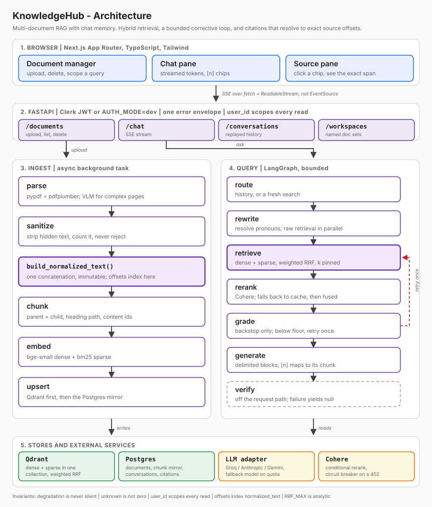

# KnowledgeHub

Multi-document RAG assistant with chat memory. Upload PDFs, text or Markdown, ask questions
across all of them, and get grounded answers whose citations resolve to exact character
offsets in the source.

Built solo, end to end: architecture, retrieval pipeline, ingest, frontend, evals.

- **Stack:** FastAPI + Next.js, Qdrant, Postgres, LangGraph
- **Retrieval:** hybrid dense + sparse, fused server-side with weighted RRF, conditional Cohere rerank
- **Tests:** 464 passing (377 backend, 87 frontend), all in CI
- **Run it:** `docker compose up --build`, no accounts needed

## Contents

1. [Running it](#1-running-it)
2. [Tech stack and why](#2-tech-stack-and-why)
3. [How I worked](#3-how-i-worked)
4. [Day by day](#4-day-by-day)
5. [Architecture](#5-architecture)
6. [The pipeline, layer by layer](#6-the-pipeline-layer-by-layer)
7. [Problems I hit](#7-problems-i-hit)
8. [Testing](#8-testing)

## 1. Running it

### Docker Compose

Fastest path. No accounts needed.

```bash
cp backend/.env.example backend/.env
cp frontend/.env.example frontend/.env.local

# Add one LLM key to backend/.env. ANTHROPIC_API_KEY is the default provider.
# Everything upstream of generation (upload, parse, chunk, embed, hybrid
# retrieval) runs with no key at all.

docker compose up --build
```

| What | Where |
|---|---|
| Frontend | http://localhost:3000 |
| Backend | http://localhost:8000 (`/healthz`, `/docs`) |
| Auth | Not needed. `AUTH_MODE=dev` maps every request to one fixed user. |
| Migrations | `alembic upgrade head` runs at container start. No separate step. |

### Manual setup

Backend, isolated in `backend/.venv`:

```bash
cd backend
poetry config virtualenvs.in-project true   # once per machine
poetry install
cp .env.example .env
docker compose up -d postgres qdrant        # just the datastores
poetry run alembic upgrade head
poetry run uvicorn app.main:app --reload --port 8000
```

Frontend, isolated in `frontend/node_modules`:

```bash
cd frontend
cp .env.example .env.local
pnpm install
pnpm dev
```

## 2. Tech stack and why

| Layer | Choice | Why |
|---|---|---|
| Vector DB | Qdrant | Dense and sparse live as named vectors in one collection, fused server-side in a single call. Pinecone needs two queries and client-side fusion. |
| Embeddings | `bge-small-en-v1.5` via fastembed | Fits in 512 MB alongside the API. `bge-base` does not. fastembed is ONNX, so no torch in the image. |
| Sparse | `Qdrant/bm25` | Same store as the dense vectors, so one query covers both branches. |
| Reranker | Cohere `rerank` (hosted) | A local cross-encoder (`bge-reranker-v2-m3`) is ~568M params. It does not fit the memory budget. |
| Orchestration | LangGraph | For checkpointing and per-node event streaming, not autonomy. The graph shape is fixed and bounded. |
| Backend | FastAPI, Python 3.12, Poetry | Async throughout, which matters when one request fans out to Qdrant, Cohere and an LLM. Dependency groups keep test tooling out of the runtime image. |
| Database | Postgres, SQLAlchemy, Alembic | Citations need real joins across documents, chunks and messages. SQLite works locally then fails on a managed host. |
| Frontend | Next.js App Router, TypeScript, Tailwind, shadcn/ui | App Router for streaming. shadcn so I own the component code instead of fighting a library's styles. |
| Auth | Clerk | Generous free tier, quick to wire. More importantly it degrades to a dev mode, so a reviewer needs no account. |
| LLM | Provider-agnostic adapter (Anthropic by default; Groq, Gemini) | Free tiers move and quotas run out mid-demo. Swapping provider is an env change, not a code change. |

Docker Compose is the primary deliverable. A free managed Postgres gets deleted 44 days
after creation, so Compose is what still works after a live link expires.

## 3. How I worked

The goal was problem solving and technical depth on something genuinely complex, not feature
count. That meant simplifying where I had a reason, adapting the workflow to my strengths, and
prioritising what actually mattered over what looked impressive in a list.

### Research with Perplexity

Most of this stack moved after any model's training cutoff, so remembered API details were
not trustworthy. I used Perplexity to pull current docs and confirm facts before building
on them:

- Whether Qdrant's `rrf` query object exposes `k` (it does, but only above 1.15)
- Cohere's trial limits, and that 402 means quota while 429 means rate
- Free tier rules for the intended host, including the instance-hour cap
- Groq's per-day token cap, which is not exposed in the rate limit headers

Anything I could not confirm went on an open questions list rather than into the design.

### Building with Claude Code

Run across several sessions. Context does not persist between sessions, so `obsidian_vault/`
holds the project's memory: decisions, the reasoning behind them, and what was already ruled
out.

Before writing code I wrote a retrieval pipeline contract with invariants, core types and
per-stage behaviour spelled out, so implementation had something to be checked against.
I also used it to write and run the measurement probes, which produced most of the findings
in [section 7](#7-problems-i-hit).

I made the architecture calls, decided what to cut, and set the rule that a number only
enters the repo if a script produced it.

### Building on my earlier project, NotebookRAG

I built a RAG app before this one
([NotebookRAG](https://github.com/RonakAjwani/NotebookRAG)). It is a reference, not a
foundation. KnowledgeHub is from scratch. I read its 2,890 lines first and made two lists.

**Ported:**

| Pattern | Why |
|---|---|
| Citation marker normalisation | Models emit markers in fullwidth and CJK lenticular brackets, not just ASCII `[1]`. Missing this alone scored correctly-cited answers as 0.0 citation accuracy on the first run. |
| `0.6 * max + 0.4 * mean` relevance blend | A precise lookup is often carried by one strongly relevant chunk. A flat mean would trip the abstention gate on exactly those. |
| Deterministic chunk IDs, `sha256(doc_id\|index\|text)` | Idempotent upserts, which is the ingest requirement for free. |
| Eval harness shape | Standalone module: dataset, metrics, runner, report. |

**Found wrong there, fixed here:**

| Issue | Impact | Resolution |
|---|---|---|
| Relevance blend self-normalised against the observed max of the candidate set | Forces max to 1.0 every query, pinning the blend above the floor so the abstention gate can never fire. Nearly harmless there because rerank almost always ran; fatal here where the fused path is the majority | Normalise against an analytic `RRF_MAX` derived from `k` and the weights (invariant I7) |
| Raw chunk text interpolated into the prompt, undelimited | Fine for a trusted personal corpus. A prompt injection hole once users upload arbitrary PDFs | Delimited `[[[DOCUMENT n]]]` blocks with the delimiter escaped inside chunk text |
| Near-duplicate dedup ran an unfiltered global vector search | An unscoped cross-tenant read path, plus one Qdrant round trip per chunk | Rejected outright. Deterministic IDs already deliver idempotency |
| Two independent concatenations of the same document | Nothing depended on them agreeing, so the drift was invisible. With offsets load-bearing it becomes a wrong highlight | One builder, one string, immutable after |
| Verifier ran in the request path | Latency tax on every answer | Moved off the request path, after the answer streams |
| No `char_start` / `char_end` on chunks | Blocks click-citation to highlighted span | Offsets designed in at ingest. Built first, since it cannot be retrofitted |

### What I cut, and why

| Cut | Reason |
|---|---|
| LlamaParse (tier 3 parsing) | Local parsing plus VLM escalation already covers the table story. A paid tier adds cost and an unconfirmed free tier for a solved problem. |
| Separate ingest worker | 750 free instance-hours per month across all services, and overrunning suspends everything. Ingest runs as a background task in the API process. |
| Uptime pinger | Same budget. A 60 second cold start is the accepted trade. |
| Contextual Retrieval | One LLM call per chunk at ingest. Wired behind a toggle, off by default. |
| HyDE, GraphRAG, embedding fine-tuning | HyDE showed no measurable retrieval gain on this corpus. GraphRAG earns its complexity on multi-hop entity networks, which this is not. Fine-tuning needs a labelled corpus I do not have. |

## 4. Day by day

| Day | What I did |
|---|---|
| 1 - Wed 29 Jul | Research and architecture. Read my earlier project ([NotebookRAG](#building-on-my-earlier-project-notebookrag)) for patterns worth porting, compared retrieval techniques, confirmed infra limits, wrote the pipeline contract and the diagram. Project setup. |
| 2 - Thu 30 Jul | Pipeline end to end: parse, chunk, embed, hybrid retrieval, the LangGraph query graph, SSE streaming, and a first working UI. |
| 3 - Fri 31 Jul | Measured instead of assumed: built the eval harness and probe scripts, then fixed what the numbers exposed (parsing accuracy, the table column binding bug, dropped text beside tables). Built the UI out properly, added the source viewer, wired up auth. |

Deployment, the frontend test suite and this README were finished Sat 1 Aug, alongside
recording the walkthrough video below.

## 5. Architecture



The two pipelines are drawn as parallel columns because that is what they are. Ingest and
query share the stores and nothing else, and they run on different requests.

Three stores, kept separate on purpose:

- **Qdrant** holds chunk vectors, dense and sparse, as named vectors in one collection.
- **Postgres** holds documents, a chunk mirror for citation resolution, conversations,
  messages, and `message_citations` (the per-citation retrieval trace).
- **Conversation state** is a rolling summary plus an entity ledger, updated after a turn
  completes, never during it, and never read by retrieval. User preferences sit in their own
  table and are also excluded from the query path, so a stored tone preference cannot
  distort what gets searched.

## 6. The pipeline, layer by layer

### Ingest

Async background task inside the API process. A 200 page PDF cannot block an HTTP request,
and a second service does not fit the hosting budget.

| Stage | What it does | Why this way |
|---|---|---|
| `parse` | Tier 1 local: `pypdf` + `pdfplumber`. Pages a cheap heuristic flags as complex escalate to a VLM, rendered with `pypdfium2`. | Escalation is paced on **tokens**, not image count, because the multimodal ceiling is TPM. A per-document cap emits a visible degradation when hit. |
| `sanitize` | Strips zero-width characters, white-on-white runs, HTML comments, PDF annotation layers. | Retrieved document text is an untrusted input channel. Findings are counted and reported, never a reason to reject a file. |
| `build_normalized_text()` | The only function permitted to concatenate parsed blocks. Returns `(text, spans)`. | Sanitisation runs **inside** it, before offsets are assigned, and the string is immutable after. Every citation in the product indexes into this exact string (I5). |
| `chunk` | Parent and child chunks. Each child gets its section heading path prepended to the embedded text. | The heading path is the only thing distinguishing twenty near-identical fund pages. IDs are content-derived, so re-ingest overwrites rather than duplicates. |
| `embed` | `bge-small-en-v1.5` dense plus `Qdrant/bm25` sparse, one point per chunk. | ONNX via fastembed, so no torch in the image. `bge-base` does not fit beside the API in 512 MB. |
| `upsert` | Qdrant first, then the Postgres mirror. | Deliberate ordering. An orphaned vector is recoverable by re-running ingest. An orphaned citation row is not. |

Upload is deduplicated by content hash, scoped per user **and** per workspace, so the same
PDF can legitimately belong to two workspaces without one silently reparenting it.

### Query

A LangGraph state graph over one shared `QueryState`. `verify` sits off the request path;
`history`, `refuse` and `abstain` are terminal nodes.

| Stage | What it does | Why this way |
|---|---|---|
| `route` | Decides whether the turn needs retrieval at all, or is answerable from conversation history. | A follow-up like "what about the other one" does not need a fresh retrieval round trip. |
| `rewrite` | Coreference resolution against recent turns and the entity ledger. | Raw-query retrieval fires **in parallel**, and the second Qdrant call is skipped when the rewrite changed nothing. Most turns cost one round trip, not two. |
| `retrieve` | Qdrant prefetches dense and sparse, then fuses with weighted RRF in one call. | `k` is pinned in config, never inherited from the server default, so `RRF_MAX` stays analytic. Per-query renormalisation would force the top score to 1.0 every time and make every downstream threshold meaningless (I7). |
| `rerank` | Cohere, with a cache and a chain that never hard-fails: Cohere, then cache, then fused order. | 402 (quota) trips a circuit breaker for the deployment. 429 (rate) backs off. Different failures, handled differently. |
| `grade` | Relevance floor, as a backstop against degenerate retrieval. | It is **not** the refusal mechanism. That is a measured conclusion, not a preference. See section 7. |
| `generate` | Chunk text in delimited `[[[DOCUMENT n]]]` blocks, delimiter escaped inside chunk text. | A document cannot forge its own block boundary. `[n]` markers map back **positionally** to the chunk that filled that slot, so a citation cannot be hallucinated into existence. |
| `verify` | Runs after the answer streams. Claim-level check against the cited passage. | A failed judge yields `null`, never `false` (I2). Reporting a citation unsupported when nobody checked it is a specific false claim. |

### Two rules that hold everywhere

- **One builder, one string.** Nothing except `build_normalized_text` may concatenate parsed
  content. A stray `.strip()` downstream invalidates every offset in the document.
- **Degradation is never silent.** Every fallback appends a `Degradation` record and emits an
  SSE event, so a degraded answer is never indistinguishable from a healthy one (I1).

## 7. Problems I hit

All found by measurement, not by reading code.

| What broke | Cause | Fix |
|---|---|---|
| Answered `55.0` for February's Manufacturing PMI (actual `56.9`), and hallucinated `26.2%` for a **blank** cell | Flattened to prose, a table row is a sequence of numbers with nothing binding each to its header. A sparse row cannot even be counted positionally | Recovered columns from geometry by clustering right edges (numeric tables are right-aligned). Widening pdfplumber's detection was the obvious fix and I had **measured it as dangerous**: text strategy alone found 16 tables on a page that has 1 |
| Half a document silently dropped | Text beside a table was never read | Assign columns beside a table instead of cropping. Coverage 50.0% to 62.5% |
| A fund's Net AUM query returned a different fund's | The answer chunk was identical to nineteen other pages, so it ranked 28 of 40 | Nest headings by font size, prepend the section path to the embedded text. Now answers at the highest relevance in the set |
| Generation quality dropped mid-testing | Groq meters its strongest model at 100k tokens/day. Invisible in the per-minute headers, only in an error body | Configured fallback model, with the switch surfaced as a degradation event rather than hidden |
| The fallback then 413'd every time | Smaller context window, but the prompt was still built at the primary's size. A 413 is not retryable | The fallback rebuilds its prompt at its own budget |
| An ingest and a delete died at random | Qdrant Cloud DNS failed roughly 1 attempt in 12 | Retry once on transport-level errors. 31/32 to 32/32 |
| Six graders were wrong **before** the pipeline was | One matched "not reported" but not "do not report", scoring a correct refusal as a hallucination. Another compared the last turn against the first turn's expectation. Two more surfaced on the provider swap: a refusal scan that read a *whole* answer, so three fully-cited answers that closed by naming what the documents do not cover scored as refusals — one of them on "no mention of figure generation", the comparative finding the question asked for; and the same scan missing a real refusal because markdown bold split `not available in` into `not available** in` | Fixed each. The first four moved the number *down*, the last two moved it *up* — either way a surprising result now sends me to check the grader first. It now has its own tests |
| Over-refusal | Tested four relevance signals across all 53 eval questions. Unanswerable questions sit **inside** the answerable range, because they ask for a figure the corpus plausibly could hold | No threshold separates them. The floor became a backstop, and the grounding prompt does the actual refusing |
| A tuned shortcut cost more than it saved | Rerank was skipped when fusion looked decisive, tuned to maximise Cohere savings. Nothing had checked what the skipped queries *lost* | Measured it: the reranker promotes a different top passage 29% of the time. Skip disabled. Ask what a change costs, not only what it saves |

**The one that changed how I work.** Retrieval was never the bottleneck. The right passage
reached the model 94% of the time and six of those answers were still wrong. A single
accuracy figure would have hidden that and sent me to tune the one stage already working.
That is why the eval reports retrieval, answer, refusal and citation accuracy separately.

### How I diagnose a wrong answer or a bad citation

The pipeline has five stages between a question and an answer on screen: `retrieve` -> `rerank`
-> `grade` -> `generate` -> `verify`. A wrong answer or a wrong citation is a symptom, not a
diagnosis, and every bug in the table above was found by checking those stages **in order**,
not by staring at the final output and guessing.

1. **Retrieval first, always.** Did the right chunk even come back in the top-k? If not, the
   model never had a chance and no prompt fix will help. This is where "Net AUM returned a
   different fund's" and both table bugs above were caught, by printing the retrieved chunks
   before generation ran at all.
2. **Then the score, not the label.** If the chunk *is* in the set but ranked low, that is a
   fusion or reranking problem, not a generation problem. The 29% reranker-disagreement number
   above is what this step is for, measure what changes, not just what should.
3. **Then the prompt boundary.** If retrieval is clean, check what actually reached the model:
   which chunks, in what order, inside which delimiters. This is where undelimited chunk text
   or a missing section-heading path shows up.
4. **Only then, the model's answer.** If everything upstream is verifiably correct and the
   answer is still wrong, that is a generation or verification bug, and it gets its own fix
   rather than a retrieval change nobody needed.
5. **Suspect the grader before the pipeline.** Six eval graders above were wrong, not the
   system under test. A surprising eval number now sends me to read the grader's code before I
   touch the pipeline, since it moved the number in both directions before I did.

Citations follow the same rule at a smaller scale: a wrong `[n]` marker is checked against the
literal `char_start`/`char_end` span it points to before assuming the model hallucinated it,
because a marker can be right while the highlight is wrong, or the reverse, and those are two
different bugs.

## 8. Testing

"Basic tests" was the starting bar. I read that as: prove the thing works, and cover the
paths that matter. I went further only where a bug produces a plausible wrong answer rather
than an error.

**464 tests. No API keys needed. All run in CI.**

| Suite | Count | Covers |
|---|---|---|
| Backend (`pytest`) | 377 | The offset property (every chunk span round-trips through `normalized_text`), RRF arithmetic, guardrail gating on both reranked and un-reranked paths, citation marker normalisation, idempotent re-ingest, the full error taxonomy, SSE frame ordering. Ten integration tests run against real Postgres and Qdrant. |
| Frontend (`vitest`) | 87 | The hand-rolled SSE parser, the chat-turn reducer, the REST error envelope, the citation chip's three verification states, citation-marker extraction, and the highlight's word-boundary and code-point offset handling. |

```bash
# Backend
cd backend
poetry run pytest -q
poetry run ruff check app tests scripts evals
poetry run mypy app

# Frontend
cd frontend
pnpm test
pnpm lint
pnpm exec tsc --noEmit
```

### The acceptance test

Unit tests cover components in isolation. This one proves the product works:

```bash
cd backend
PYTHONPATH=. poetry run python scripts/verify_api.py
```

Uploads real documents to a running API, waits for ingest, asks a question, resolves a
citation back to the literal characters in the source, asks a follow-up with a pronoun and
confirms it resolves against conversation memory, confirms persistence, and exercises the
error taxonomy. 32 checks.

### Measurement scripts

| Script | What it does |
|---|---|
| `probe_guardrails.py` | Attacks the guardrails with a hostile document. 8 of 8 blocked. |
| `probe_rrf_rank_base.py` | Measures whether Qdrant ranks RRF from 0 or 1. Every relevance threshold derives from it, so re-run after a version bump. |
| `probe_golden_set.py` | Confirms every expected fact survived parsing, before spending tokens on an eval run. |
| `evals/run.py` | Full eval. Reports retrieval, answer, refusal and citation accuracy separately. |

CI runs lint, typecheck and both suites on every push, with Postgres and Qdrant as service
containers so the integration tests execute rather than skip. The eval and `verify_api.py`
are deliberately not gated: both need live keys, and a job that goes green because a secret
is unset reports "tests pass" while testing nothing.
